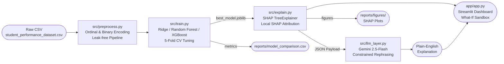

# Explainable Student Performance Prediction with an LLM Explanation Layer

> A college mini-project combining Machine Learning, Explainable AI (SHAP), and a constrained Large Language Model to predict student exam performance and translate the results into plain-English advice.

---

## Architecture Overview



**Three-Layer Design Principle:**
1. **ML Prediction** — The model predicts a numeric score from student features.
2. **SHAP Attribution** — `TreeExplainer` calculates the exact contribution of each feature to that individual prediction (no guessing).
3. **LLM Verbalization** — Gemini is given *only* the SHAP payload and asked to rephrase it. It is explicitly forbidden from inventing new reasons.

---

## Project Structure

```
Student performance/
├── data/
│   └── student_performance_dataset.csv   # Raw dataset (708 students × 10 columns)
├── notebooks/
│   └── 01_eda.ipynb                       # Exploratory Data Analysis
├── src/
│   ├── preprocess.py                      # Leak-free encoding & cleaning
│   ├── train.py                           # Model training, tuning, comparison
│   ├── labels.py                          # Fail/Borderline/Pass band conversion
│   ├── explain.py                         # SHAP explainer & payload generator
│   ├── llm_layer.py                       # Gemini API + template fallback
│   └── evaluate.py                        # Faithfulness evaluation (N=50)
├── models/
│   ├── best_model.joblib                  # Saved best estimator (Random Forest)
│   ├── preprocessor.joblib                # Fitted ColumnTransformer
│   ├── feature_names.joblib               # Ordered feature list
│   ├── X_test_proc.joblib                 # Processed test features
│   ├── X_test_raw.joblib                  # Raw test features (for SHAP context)
│   └── y_test.joblib                      # Test labels
├── app/
│   └── app.py                             # Streamlit interactive dashboard
├── reports/
│   ├── figures/                           # EDA & SHAP plots (PNG, 300 DPI)
│   ├── model_comparison.csv               # RMSE / MAE / R² comparison
│   ├── threshold_sensitivity.csv          # Fail/Pass threshold sweep
│   ├── llm_eval.csv                       # LLM faithfulness audit results
│   └── viva_notes.md                      # Examiner Q&A preparation
├── requirements.txt                       # Pinned dependencies
├── .env.example                           # API key template
├── .gitignore
└── README.md
```

---

## Setup Instructions

### 1. Clone / Navigate to the Project
```bash
cd "/Users/pratham/Coding/Student performance"
```

### 2. Create and Activate a Virtual Environment
```bash
python3 -m venv .venv
source .venv/bin/activate
```

### 3. Install Dependencies
```bash
pip install -r requirements.txt
```

### 4. Configure the Gemini API Key
```bash
cp .env.example .env
# Open .env and paste your key:
# GEMINI_API_KEY=AIza...
```
Get a free key at [https://aistudio.google.com/app/apikey](https://aistudio.google.com/app/apikey).
> The application works **without** an API key — it falls back to a deterministic template automatically.

---

## How to Run

Always activate the virtualenv first:
```bash
source .venv/bin/activate
```

### EDA Notebook
```bash
jupyter notebook notebooks/01_eda.ipynb
```

### Preprocessing Smoke Test
```bash
python3 src/preprocess.py
```

### Train Models & Save Artifacts
```bash
python3 src/train.py
```
Outputs: `models/`, `reports/model_comparison.csv`, `reports/threshold_sensitivity.csv`

### Generate SHAP Explanations & Figures
```bash
python3 src/explain.py
```
Outputs: `reports/figures/05_shap_summary_beeswarm.png`, `reports/figures/06_shap_global_bar.png`

### LLM Layer Smoke Test (3 Sample Students)
```bash
python3 src/llm_layer.py
```

### Faithfulness Evaluation (50 Students)
```bash
python3 src/evaluate.py
```
Outputs: `reports/llm_eval.csv`

### Streamlit Interactive Application
```bash
# From the project root (IMPORTANT: not from inside app/)
streamlit run app/app.py
```
Then open **http://localhost:8501** in your browser.

---

## Results Summary

### Model Performance (Test Set, N = 142)

| Model | RMSE ↓ | MAE ↓ | R² ↑ |
|---|---|---|---|
| **Random Forest (Winner)** | **2.97** | **2.04** | **0.793** |
| XGBoost | 3.32 | 2.41 | 0.741 |
| Ridge Regression | 3.82 | 3.11 | 0.656 |

Random Forest outperforms the linear baseline by **0.85 RMSE points** (+13.6% R²), justified by non-linear interaction effects between attendance and prior scores.

### Classification Bands (Threshold: Fail < 55, Borderline 55–59, Pass ≥ 60)

| Band | Test Count | Model Recall |
|---|---|---|
| Fail (< 55) | 47 | 78.7% |
| Borderline (55–59) | 24 | 33.3% |
| Pass (≥ 60) | 71 | 88.7% |

### SHAP Global Feature Importance (Top 3 Drivers)
1. **Attendance_Rate** — Strongest local and global SHAP driver; consistently dominates predictions.
2. **Past_Exam_Scores** — Second most influential; historical performance is a strong predictor.
3. **Study_Hours_per_Week** — Controllable behavioral lever with meaningful positive SHAP impact.

### LLM Faithfulness Evaluation (N = 50, gemini-2.5-flash)

| Metric | LLM Layer | Template Fallback |
|---|---|---|
| Mean Factor Recall | 78.4% | 77.4% |
| Mean Faithfulness Score | 0.784 | 0.774 |
| Hallucination Rate | **0.0%** | **0.0%** |
| Forbidden Advice Rate | **0.0%** | **0.0%** |
| Causal Language Rate | **0.0%** | **0.0%** |

Both the LLM and the template baseline achieved zero hallucinations, zero ethical violations, and zero causal-language violations across all 50 evaluated explanations.

---

## Known Limitations

1. **Dataset is likely synthetic** — `student_performance_dataset.csv` (708 records) appears to be procedurally generated. Real-world performance distributions rarely exhibit such a clean $50$–$77$ score boundary or perfectly balanced 50/50 Pass/Fail splits. Model conclusions should not be generalized to real student cohorts without validation on authentic data.

2. **Correlations, not causation** — SHAP attribution values quantify each feature's *statistical association* with the predicted score inside the Random Forest model. They do **not** imply that improving attendance *causes* score improvement in the real world. Confounding variables (e.g., student engagement, socioeconomic context) are not captured.

3. **Threshold was chosen manually** — The Fail/Borderline/Pass boundaries (`< 55` / `55–59` / `≥ 60`) were selected after a threshold sensitivity experiment on this specific dataset. Different score distributions would require different thresholds; there is no universal correct cutoff.

4. **LLM may still produce errors** — Despite strict system prompts, low temperature (`0.2`), and JSON-grounding, `gemini-2.5-flash` occasionally paraphrases imprecisely or omits a minor factor. The 54% full-compliance rate at $N=50$ reflects that even well-constrained LLMs can diverge from exact formatting instructions. The deterministic template fallback guarantees structure compliance.

5. **Free-tier API quota limits** — The Gemini API free tier (20 requests/day) limits live LLM explanations in batch settings. The template fallback activates automatically when quota is exhausted.

---

## License
Academic / Educational Use Only
